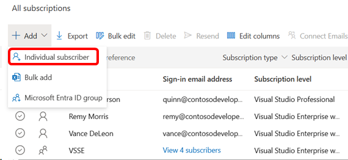
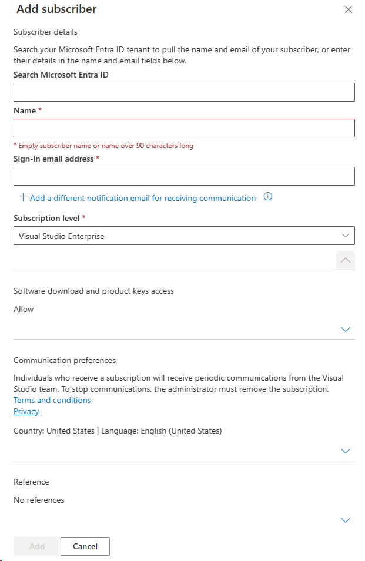

# Assign licenses in the Visual Studio Subscriptions Administration Portal
As a Visual Studio subscriptions admin, you can use the admin portal to assign subscriptions to individual users and groups of users.

For groups of users, you have choices for how you assign subscriptions.  
- You can assign subscriptions one at a time.
- You can also quickly and easily upload lists of subscribers and their subscription information using the [Bulk add](assign-license-bulk.md) feature.
- If your organization uses Microsoft Azure Active Directory (Azure AD), you can [use Azure AD groups to assign subscriptions](./assign-license-bulk.md#use-azure-active-directory-groups-to-assign-subscriptions) to groups of users.  

## Add a single subscriber
Watch the video or read on to learn how to assign a Visual Studio subscription to a new user so that they can access the subscription benefits.

 

> [!VIDEO https://www.microsoft.com/videoplayer/embed/RE4vpPh]

1. Sign in to the [admin portal](https://manage.visualstudio.com).
2. To assign a license to a single Visual Studio subscriber, at the top of the table, select **Add**, then choose **Individual subscriber**.
   > [!div class="mx-imgBorder"]
   > 
3. A fly-out panel will appear to the right.  Enter the information into the form fields for the new subscriber. 
   - If your organization is using Azure Active Directory, typing the name of the subscriber in the **Search Azure Active Directory** box will return the names of any Azure AD group members matching your criteria.  After you select that person, sign-in email and notification email will automatically populate.  
   - If the subscriber is not found in your organization, you can enter the subscriber's name in the **Name** field.  
   - Enter the email address you want your subscriber to use to sign in.  You can also click on the **Add a different notification email for receiving communication** link and specify a different notification email address so subscribers and admins receive important subscription-related emails from Microsoft.
      > [!div class="mx-imgBorder"]
      > 

      > [!NOTE]
      > In order for members of an Azure Active Directory tenant to be visible when you enter a subscriber name, the admin must be a member of the tenant. 
   - Choose the subscription level you want to assign to this user.  (The list only contains the subscription levels that were purchased as part of your agreement.)  
   - If you want this subscriber to have access to software downloads when they sign into the [Visual Studio Subscriptions Portal](https://my.visualstudio.com?wt.mc_id=o~msft~docs), make sure to leave the downloads toggle enabled in the **Download Settings** section. If you choose to disable downloads, the user will not have access to software downloads or product keys.  The subscriber will still have access to all other benefits included in the subscription.
     > [!div class="mx-imgBorder"]
     > 

   - If you'd like to add your own reference notes to the subscription, you can do so in the **Add reference** section.
      > [!div class="mx-imgBorder"]
      > 

    When you're done selecting options and entering data for the subscriber, choose **Add** at the bottom of the **Add Subscriber** fly-out.
      > [!div class="mx-imgBorder"]
      > 

## Why use a different notification email address?
Some organizations set up their email services to block incoming emails from other domains.  Blocking incoming emails means that subscribers and admins will miss important communications:
  - Subscribers will not receive a notification that a subscription has been assigned to them.  This will also prevent them from activating some of the included benefits.  
  - Subscribers who have been assigned Visual Studio subscriptions with GitHub Enterprise will not receive the invitation to join your GitHub organization, meaning they will be unable to accept the invitation. They **must accept the emailed invitation** in order to gain access to your GitHub organization. 
  - Admins will not be notified when they are added to an agreement, receive monthly admin statements or notifications of feature changes that affect the way they manage subscriptions.

Using a notification email address provides you with the option to allow your subscribers to receive important communications about their subscriptions without changing the functionality of their sign-in email addresses.  

## Resend assignment emails
After you add a subscriber, an assignment email will be automatically sent to the new subscriber with further instructions. You can send the assignment email again at any time by selecting the subscriber and then selecting the **Resend** button in the top menu.  To resend emails to multiple users, hold down the **Ctrl** key while selecting the subscribers.  When you select the **Resend** button, you'll see a dialog asking you to confirm you want to resend to those subscribers.  

## Resources
- Need help?  Contact [Subscriptions Support](https://aka.ms/vsadminhelp).

## See also
- [Visual Studio documentation](/visualstudio/)
- [Azure DevOps documentation](/azure/devops/)
- [Azure documentation](/azure/)
- [Microsoft 365 documentation](/microsoft-365/)

## Next steps
- Have a lot of users to add?  Learn how to assign subscriptions to [multiple subscribers](assign-license-bulk.md).
