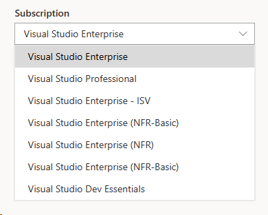

# How to sign in to Visual Studio subscriptions
Visual Studio subscriptions are accessed via the subscriber portal at https://my.visualstudio.com. How you access the portal depends on how you got your subscription. This article walks you through the various ways to sign in based on where you got the subscription. 

Signing into the portal requires the use of a sign-in ID, which consists of an email address and password. Let's look at how to use the various types of sign-in IDs.  

## Sign in with your Microsoft Account (MSA)
Many subscribers sign in to the portal using their MSA. This scenario is true for subscriptions purchased by individuals, such as those bought in the Microsoft Store. Check out this article for more information on [activating and accessing retail subscriptions](buy-activate-retail.md). If you joined the Visual Studio Dev Essentials program, you use your MSA to access that as well. 

To sign in with your MSA:
1. Visit [https://my.visualstudio.com](https://my.visualstudio.com?wt.mc_id=o~msft~docs).
2. Enter the email address you provided when you set up or purchased your Visual Studio subscription.

   > [!NOTE]
   > This address is also identified in the subscriber welcome email you received when you purchased the subscription or signed up for Visual Studio Dev Essentials. Please check your junk mail folders if you have trouble locating the welcome email.

3. Enter your password.
4. Select **Sign in**.
5. At this point, the "Benefits" page should be displayed.

## Sign in with a work or school account
If your subscription was provided to you by your company or school, use the credentials you use at work or school to sign in to the subscriber portal.  

1. Visit [https://my.visualstudio.com](https://my.visualstudio.com?wt.mc_id=o~msft~docs).
2. Enter the email address to which the new Visual Studio subscription was assigned.

   > [!NOTE]
   > This address is also identified in the subscriber welcome email you received. Please check your junk mail folders if you have trouble locating the welcome email.

3. Select **Continue**.
4. You're redirected to your corporate sign-in page.
5. Enter your password.
6. Select **Sign in**.
7. At this point, the "Benefits" page should be displayed.

## Frequently Asked Questions

### Q: When I try to sign in to the subscriber portal, it doesn't find any subscriptions for me. What should I do?
A: If you're not seeing any subscriptions and you're sure you have one, you're probably signing in with a different ID than the one associated with the subscription. For example, if your subscription was assigned to you by your employer and you try to sign in with your personal email (MSA), it doesn't find the subscription. If you can't find a subscription, try signing in with a different ID. 

### Q: I can sign into the portal but all I see is a Visual Studio Dev Essentials subscription. How do I find my other subscriptions?
A: If you're sure you have other subscriptions but you're only seeing Dev Essentials, there are two common causes. 
+ You're using a different sign-in ID than the one associated with your other subscription. This cause occurs most often the case when your subscription was provided by your work or school. Sign out of the portal and sign back in with your work or school email address to see those subscriptions. 
+ You signed in with the right ID, but the portal is just displaying a different subscription. There are two ways to view and switch between subscriptions:
    + On the Benefits page, the subscription in use is displayed in the drop-down list next to the *Featured benefit*. You can use the drop-down to switch between subscriptions if you have more than one. If you only have one, the drop-down is disabled. 
  > [!div class="mx-imgBorder"]
  > 
    + Select the Subscriptions tab at the top of the page.  A complete list of any subscriptions you have is displayed.  Select one to switch to it.  
  > [!div class="mx-imgBorder"]
  > 

### Q: I should have a subscription from my employer, but I don't see it. What's wrong?
A:  There are several reasons you might not see a subscription:
+ It could be expired. Only active subscriptions are displayed in the subscription portal.
+ It could be associated with a different email address. If you have multiple subscriptions assigned to different email addresses, you only see one at a time. To switch to a different subscription, sign out of the portal and sign in with the email associated with the desired subscription. 
+ If your company buys subscriptions through a Volume License, it's possible that your admin didn't assign one to you or might have reassigned your subscription to another user. If you suspect that's the case, you might wish to reach out to your admin. If you're not sure who your admin is, try checking with a colleague who has a subscription. They should have a ["Contact my Admin"](contact-my-admin.md) button in the portal and can help get you in touch with your admin.  

## Resources
[Visual Studio subscriptions support.](https://aka.ms/vssubscriberhelp)

## See also
+ [Visual Studio documentation](/visualstudio/)
+ [Azure DevOps Services documentation](/azure/devops/)
+ [Azure documentation](/azure/)
+ [Microsoft 365 documentation](/microsoft-365/)

## Next steps
Get started using your benefits by signing in to [https://my.visualstudio.com/benefits](https://my.visualstudio.com/benefits) . 