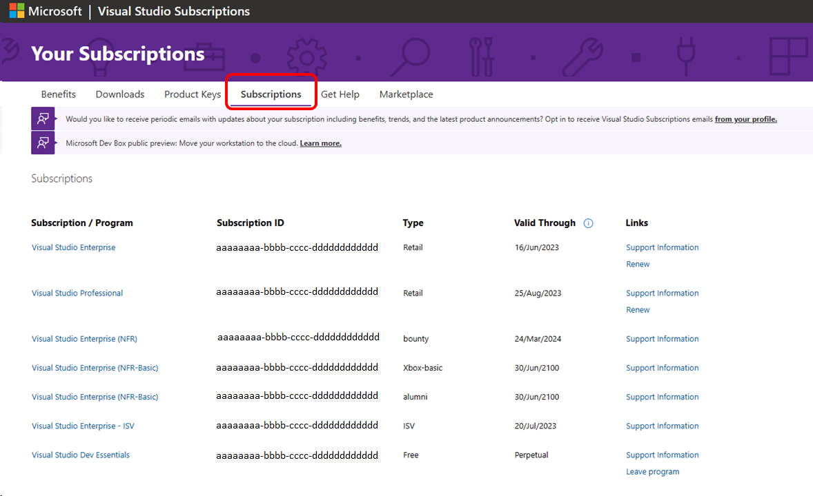
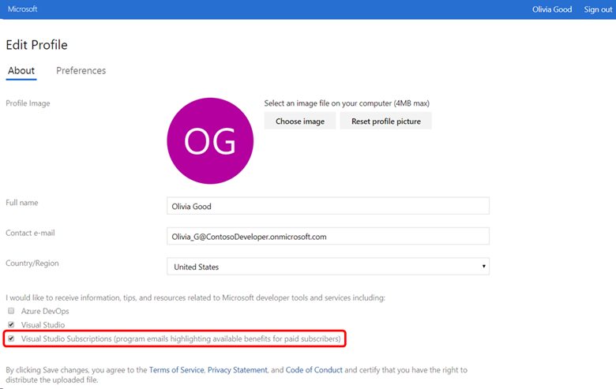

# Managing subscriptions

The Visual Studio [Subscriber Portal](https://my.visualstudio.com) gives you the ability to manage all your subscriptions and program memberships in a single place. You can make changes to your profile, use all of the benefits included with your subscriptions, and switch between subscriptions quickly and easily.

## Managing multiple subscriptions

The Visual Studio subscriptions portal brings together all your Visual Studio subscriptions and programs in a single improved portal experience. For example, you might have a standard subscription such as Visual Studio Enterprise through work, and a monthly Visual Studio Professional subscription or Visual Studio Dev Essentials membership you use at home.

### Which subscription am I using?

On the Benefits page, the subscription in use will be prominently displayed in the blue banner. It's also displayed in the upper-right of the page.
> [!div class="mx-imgBorder"]
> 

### To switch between subscriptions, you can:

- Select the drop-down in the top right and choose the subscription from the list
- Select the Subscriptions tab and then select the desired subscription
  > [!div class="mx-imgBorder"]
  > 

### If your subscription is not visible...

- It may be expired. Only active subscriptions are displayed in the Subscriber Portal.
- It may be associated with a different email address. For example, if you sign in to a Visual Studio Professional subscription with your work/school email and have a Visual Studio Dev Essentials membership associated with your Microsoft Account, you will only see the subscription corresponding to the email address you used to sign in to the Subscriber Portal. To see the other subscription, you will need to sign out, and then sign in with the other email address.
- If your company buys subscriptions through a Volume License, your admin may not have assigned a subscription to you or may have reassigned your subscription to another user.

## Renewing my subscriptions

**Standard subscriptions**
- Microsoft Store: If you purchased your subscription from the [Microsoft Store](https://www.microsoft.com/store), you can renew it there as well.
- Volume License:  If your company buys subscriptions through a Volume License, your admin should contact a reseller to renew your subscriptions.

**Cloud subscriptions:**  Cloud subscriptions don't need to be renewed. As long as your subscription is paid, it will remain active.

**Subscriptions acquired through programs:**  If you get your subscription through a program, your subscription is tied to your participation in the program. Please reach out to your program contacts for additional information.

- [Imagine](https://imagine.microsoft.com/about)
- [Microsoft Partner Network](https://partner.microsoft.com)
- [Microsoft Certified Trainer](https://www.microsoft.com/learning/mct-certification.aspx)

## Transferring subscriptions

If your subscription was purchased through Microsoft Volume Licensing and you need to re-assign it to someone else within the organization, your admin will need to do this for you.
Retail subscriptions can be transferred to another user by contacting Customer Service. Complimentary or “Not For Resale” subscriptions cannot be transferred.

## Managing my profile

The subscriptions portal lets you create and manage a profile, making subscriptions management easy. You can make changes to your identity information, and you can associate your subscriptions with other sign-in identities from existing Azure accounts or Azure DevOps organizations using alternate identities.

### Changing profile information

You can easily change the contact information and preferences in your profile.

1. Select your name in the upper right corner of the Subscriber Portal.
2. Select the **Edit profile** button.
3. On the **About** tab, you can change your name, email, country/region, profile picture and contact preferences. On the **Preferences** tab, you can select your preferred language, date and time patterns, time zone, and user interface theme.
4. When you’ve finalized your changes, select **Save**.
5. Select your browser's **back** button to return to the Benefits page.

### Setting communications preferences
If you would like to receive periodic updates about your subscription and benefits, including the monthly Visual Studio Subscriptions newsletter, [update your preferences](https://app.vsaex.visualstudio.com/me?workflowID=devprogram&tab=edit) by checking the box for Visual Studio Subscriptions in your Visual Studio profile. You can change these preferences and unsubscribe at any time. 

   > [!div class="mx-imgBorder"]
   > 
   
### Linking my subscription to existing Azure DevOps Services or Azure subscriptions
If you sign in to your subscription using a personal Microsoft account (MSA) and have a subscription that includes Azure DevOps Services or Microsoft Azure using a work or school account managed by Azure, you can link the two subscriptions. This is called an "alternate account" and allows you to keep using your MSA to sign in to your subscription while having access to existing Azure, Azure DevOps Services or IDE resources that are associated with your school or work accounts.

Even if both accounts use the same email address, you need to add your work/school account as an alternate to use your benefits across both accounts.

To add an alternate account:

1. Sign in to the [Subscriber Portal](https://my.visualstudio.com?wt.mc_id=o~msft~docs) with your Microsoft Account (MSA).
2. Select the **Subscriptions** tab.
3. Under **Related Links**, choose **Add alternate account**.
4. Enter your work/school account email address and select **Add**.

Once you have added an alternate account, you can update or remove it at any time by selecting the **Subscriptions** tab and choosing the appropriate option in the **Related Links** section.

## Frequently asked questions

### Q: If I do not renew my subscription, how long will Microsoft keep my data?
A: Depending on the purchasing channel, Microsoft maintains customer data for different lengths of time.

| Channel                                                | Duration (days) |
|--------------------------------------------------------|-----------------|
|    Retail (e.g. through Microsoft Store)               |    360          |
|    Volume Licensing Service Center (VLSC)              |    180          |
|    Microsoft Products and Services Agreement (MPSA)    |    180          |
|    Visual Studio Cloud Subscriptions                   |    180          |
|    Program (e.g. MCT, MPN, Imagine)          |    180          |
|    Not For Resale (e.g. MVP, MSP)                      |    180          |
|    DevEssentials                                       |    30           |

> [!NOTE]
> - If you choose to close your Microsoft Account or Azure AD, your personal data will be anonymized immediately.
> - We will not fully remove all your personal data if you have active subscriptions.

## Support resources
- For assistance with sales, subscriptions, accounts and billing for Visual Studio Subscriptions, contact [Visual Studio subscriptions support](https://aka.ms/vssubscriberhelp).

## See also
- [Visual Studio documentation](/visualstudio/)
- [Azure DevOps documentation](/azure/devops/)
- [Azure documentation](/azure/)
- [Microsoft 365 documentation](/microsoft-365/)

## Next steps
Do you manage subscriptions for your organization?  Learn more about managing Visual Studio subscriptions:
- [Assign individual subscriptions](assign-license.md)
- [Assign multiple subscriptions](assign-license-bulk.md)
- [Edit subscriptions](edit-license.md)
- [Delete subscriptions](delete-license.md)
- [Determine maximum usage](maximum-usage.md)