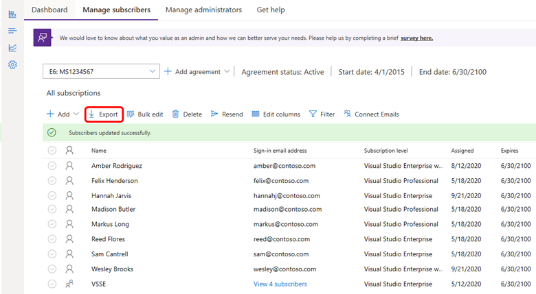
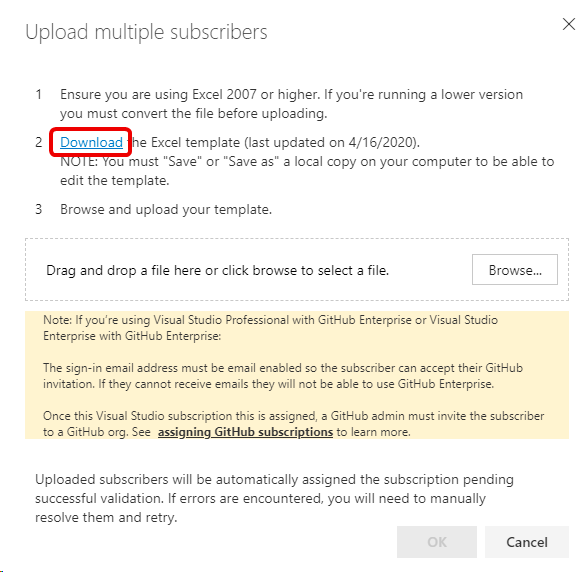
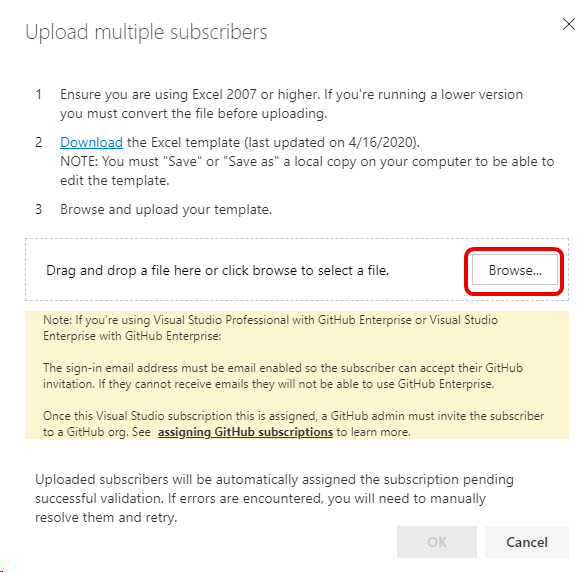

# How to migrate subscriptions from one agreement to another
If you have Visual Studio subscriptions assigned to subscribers as part of one agreement and your company purchases a new agreement, you may need to migrate subscribers from the current agreement to the new one.  This article will detail the steps to move your assigned subscriptions to the new agreement.  

When you move your subscribers to the new agreement, here's what will happen:
- They will get a new subscription GUID.
- Their benefits will be reset. For example, if they have previously used a training benefit, they will receive a new instance of that benefit. 
- If they were using Azure individual credits in their old subscription, they will need to activate a new one and transfer their Azure assets to it. 

The process for moving subscribers to the new agreement consists of three steps:
1. Export your current subscription assignments in the old agreement. 
2. Prepare a subscription list for uploading to the new agreement. 
3. Upload your subscription list to the new agreement.

> [!IMPORTANT]
> There are a couple of important things to note before beginning this process.
> - If your reseller selected the option to automatically transfer the subscribers to the new agreement when it was purchased, it can take up to 48-72 hours after the agreement was submitted to see the changes. Before proceeding with the process to manually move your subscribers, please check with your reseller.  
> - You can use Azure Active Directory groups to simplify the process of moving subscribers to the new agreement.  For more information, please see our article about [assigning subscriptions using Azure AD groups](assign-azure-ad.md).

## Export your current subscription assignments
The first step to migrate your assigned subscriptions from one agreement to another is to export your current subscription assignments as a CSV file.  In the Visual Studio Subscriptions Administration Portal, you can export a list of your subscribers and details about their assignments. This information includes their name, email address, notification email address, subscription level, assigned date, expiration date, reference field, whether downloads are enabled, country, language, subscription status, and subscription GUID. The list is exported as a CSV file which can easily be opened in Microsoft Excel so you can prepare it for uploading in the new agreement.

To export your assigned subscriptions:
1. Sign in to the [admin portal](https://manage.visualstudio.com).
2. Select the **Export** tab.
3. A CSV file will be downloaded to your computer.  The name of the file will reflect the name and type of your current agreement as well as the date the file was created.  

> [!div class="mx-imgBorder"]
> 

## Prepare your subscription list for uploading to the new agreement
Follow these steps to open your exported subscriptions list and move the relevant data to a template for uploading to the new agreement:
1. Locate the file created when you exported your subscriptions list, and open it.  You should see the following column names, and their associated data:
- **Subscriber Name**
- **Email**
- **Notification Email Address**
- AAD Group 
- **Subscription Level**
- Assigned
- Activated 
- Expiration Date (UTC)
- **Reference**
- **Downloads**
- **Country**
- **Language**
- Subscription Status
- **Subscription GUID**
- Usage Status
Not all the fields in the exported CSV file will be needed in the file used to upload your subscriptions to the new agreement.  The fields in **bold** above will appear in the template used to upload your list. 

2. Download the Excel template used to upload your subscriptions.  
- Sign in to the [admin portal](https://manage.visualstudio.com)
- On the **Manage Subscribers** tab, choose your new agreement from the dropdown list.  
> [!div class="mx-imgBorder"]
> 
- Click **Add**, and choose **Bulk add**.
- The "Upload multiple subscribers" dialog will appear.  
- In step 2, select the **Download** link to download the template. 
> [!div class="mx-imgBorder"]
> 
- The template will appear in your normal downloads folder location.  
- Open the template.

3. With both the exported subscriber list and blank bulk add template open, you'll need to manually copy and paste your subscription data from the exported list into the template. 

Please be aware that the order of the columns in the exported subscriber list is different than the columns in the template.  The names of the columns also differ slightly.  The table below shows the names of the fields that are common to both spreadsheets:

| EXPORT LIST                | BULK ADD TEMPLATE  |
|----------------------------|--------------------|
| Subscriber Name            | Name               |
| Email                      | Sign-in Email      |
| Notification Email Address | Notification Email |
| Subscription Level         | Subscription Level |
| Reference                  | Reference          |
| Downloads                  | Downloads          |
| Country                    | Country            |
| Language                   | Language           |
| Subscription GUID          | Subscription GUID  |

> [!TIP]
> If you have a lot of subscribers, you may find using keyboard shortcuts helpful when copying and pasting data. 
> To select all of the entries in a column such as subscriber names, click on the first entry in the column (not the column heading), press and hold Ctrl+Shift, and press the down arrow.  This will select all of the data in that column.  

4. When all of your data has been moved over to the bulk add template, save the template and close it.  This is the subscription list that will be uploaded to your new agreement.

## Upload your subscription list to the new agreement
-  In the [admin portal](https://manage.visualstudio.com), if the "Upload multiple subscribers" dialog is still open, click the **Browse** button, browse to the location where you saved your subscription list, select it, and click **Open**.  
> [!div class="mx-imgBorder"]
> 
- The name of your subscription list will now appear in the "Upload multiple subscribers" dialog.  Click **OK** to upload the file. 
- In the admin portal, you may briefly see a status message stating that a file is being uploaded.  When the upload is completed, you will see the message "Subscribers updated successfully".
This will complete the migration of your subscribers from your old agreement to your new one.  
> [!NOTE]
> After your subscribers have been added to your new agreement, you should remove them from your old agreement.  This will prevent your subscribers from getting notifications about their old subscriptions.

## Resources
- For assistance with managing Visual Studio subscriptions, see Visual Studio [Subscriptions support](https://aka.ms/vsadminhelp).

## See also
- [Visual Studio documentation](/visualstudio/)
- [Azure DevOps documentation](/azure/devops/)
- [Azure documentation](/azure/)
- [Microsoft 365 documentation](/microsoft-365/)

## Next steps
- [Use Azure Active Directory groups to assign additional subscriptions](assign-azure-ad.md). 
- [Edit existing subscriptions](edit-license.md)
