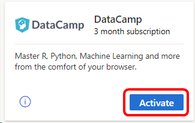

# The DataCamp training benefit in Visual Studio subscriptions

Eligible Visual Studio subscriptions include subscriptions to DataCamp.  With DataCamp, you can learn all the data science skills you need from the comfort of your browser. You get to choose when and what you learn. With no software to install and no special hardware requirements, learning data science is easier than ever.

## Activation steps

1. Sign in to [https://my.visualstudio.com/benefits](https://my.visualstudio.com/benefits?wt.mc_id=o~msft~docs).

2. Locate the DataCamp benefit tile in the "Professional Development" category, and select on **Activate**.
   > [!div class="mx-imgBorder"]
   > 

3. On the DataCamp page, you can create a new account.  You can choose to enter an email address and password, or sign in using existing accounts from Facebook, LinkedIn, or Google.  Provide your sign-in information and select **Get Started**.

   > [!NOTE]
   > When you begin creating your account, you may receive the following error message: "OOPS!  Your promo code is invalid or expired."  This happens because when your promo code is created, it expires after a few minutes.  If you receive this message, simply return to the [Benefits](https://my.visualstudio.com/benefits) page and select on the **Activate** link on the DataCamp benefit tile.

4. After your account has been created, you can choose a learning path.  Options include:
    - Learning R for Data Science
    - Start Learning Python for Data Science
    - Develop your Data Science Skillset

   Just select your chosen path to get started.
   > [!div class="mx-imgBorder"]
   > 

5. After you've selected your path, you can further refine your learning path by selecting a goal.  For example, if you chose the "Develop your Data Science Skillset" path, you'll see the following options. Choose an option, or select **I am not sure.  Show me all career paths** to create a broader path.
   > [!div class="mx-imgBorder"]
   > 

6. Based on the path and options you've selected, you'll see a selection of Career Tracks.  Select the **Enroll** button for the track of your choice.
   > [!div class="mx-imgBorder"]
   > 

7. After you've enrolled in your track, the first course in that track will open.  You'll see a tutorial explaining how to interact with the course, including navigation and completing the course exercises.

   > [!div class="mx-imgBorder"]
   > 

You can stop at any point, and resume your training in your next session.  Just visit [https://www.datacamp.com](https://www.datacamp.com), and sign in.  You'll see your dashboard and can resume your training right where you paused. Simply select **Continue Track**.

> [!div class="mx-imgBorder"]
> 

## Eligibility

| Subscription Level | Channels | Benefit | Renewable? |
|--------------------|----------|---------|------------|
| Visual Studio Enterprise (Standard)   | VL, Azure, Retail, | 3-months |  No.  Available to new subscribers only |
| Visual Studio Enterprise subscription with GitHub Enterprise   | VL | 3-months |  No.  Available to new subscribers only |
| Visual Studio Professional (Standard) | VL, Azure, Retail  | 3-months |  No.  Available to new subscribers only |
| Visual Studio Professional subscription with GitHub Enterprise| VL | 3-months |  No.  Available to new subscribers only |
| Visual Studio Test Professional (Standard) | VL, Retail | 3-months |  No.  Available to new subscribers only |
| MSDN Platforms (Standard) | VL, Retail | 3-months |  No.  Available to new subscribers only |
| Visual Studio Enterprise (Standard)  | NFR\* |Not available  | N/A |
| Visual Studio Enterprise, Visual Studio Professional (monthly cloud) | Azure | Not available | N/A |

\*  *Includes:  Not for Resale (NFR), FTE, Most Valuable Professional (MVP), Regional Director (RD), Microsoft Partner Network (MPN), Visual Studio Industry Partner (VSIP), Microsoft Certified Trainer, BizSpark, Imagine.  Excludes:  NFR Basic*

> [!NOTE]
> Microsoft no longer offers Visual Studio Professional Annual subscriptions and Visual Studio Enterprise Annual subscriptions in Cloud Subscriptions. There will be no change to existing customers experience and ability to renew, increase, decrease, or cancel their subscriptions. New customers are encouraged to go to [https://visualstudio.microsoft.com/vs/pricing/](https://visualstudio.microsoft.com/vs/pricing/) to explore different options to purchase Visual Studio.

Not sure which subscription you're using?  Connect to [https://my.visualstudio.com/subscriptions](https://my.visualstudio.com/subscriptions?wt.mc_id=o~msft~docs) to see all the subscriptions assigned to your email address. If you don't see all your subscriptions, you may have one or more assigned to a different email address.  You'll need to sign in with that email address to see those subscriptions.

## Support resources

+ Need help with using DataCamp?  Check out these resources:
  + [DataCamp Community](https://www.datacamp.com/community/tutorials), featuring forums and tutorials.
  + [DataCamp Help Center](https://support.datacamp.com/hc), where search support topics and see request user questions.
  + [Submit a support request](https://support.datacamp.com/hc/requests/new)
+ For assistance with sales, subscriptions, accounts and billing for Visual Studio Subscriptions, contact [Visual Studio subscriptions support](https://my.visualstudio.com/gethelp).
+ Have a question about Visual Studio IDE, Azure DevOps Services or other Visual Studio products or services?  Visit [Visual Studio Support](https://visualstudio.microsoft.com/support/).

## See also

+ [Visual Studio documentation](/visualstudio/)
+ [Azure DevOps documentation](/azure/devops/)
+ [Azure documentation](/azure/)
+ [Microsoft 365 documentation](/microsoft-365/)

## Next steps

Check out more professional development opportunities in your subscription:
+ [Pluralsight](vs-pluralsight.md)
+ [LinkedIn Learning](vs-linkedin-learning.md)

If you haven't already activated the Azure DevTest individual credit benefit that comes with your subscription, visit [https://my.visualstudio.com/benefits](https://my.visualstudio.com/benefits?wt.mc_id=o~msft~docs) and select the Azure tile in the Tools category to set up your Azure subscription and redeem your Azure DevTest individual credit.