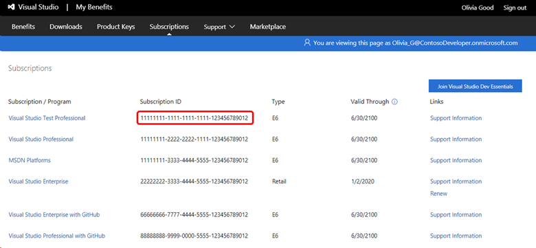
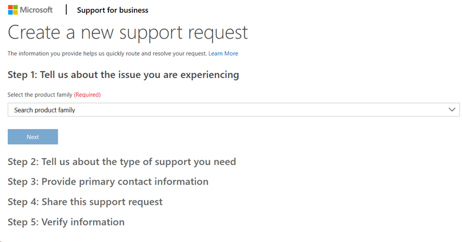
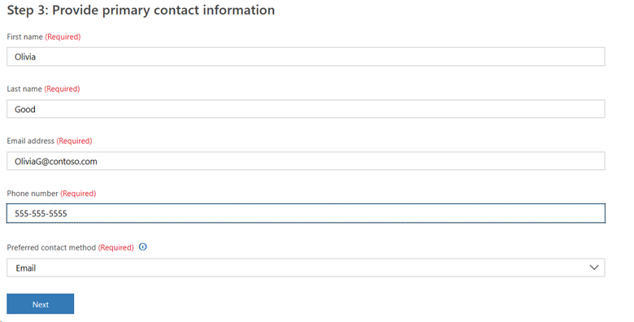

# Activate and use the Technical Support benefit in Visual Studio subscriptions

The Technical Support benefit in Visual Studio subscriptions is for resolving break-fix issues in **non-production environments** for products that are still in the mainstream support phase of the [support lifecycle](https://support.microsoft.com/lifecycle/search). Visual Studio Enterprise standard and annual cloud subscriptions receive four incidents, while Visual Studio Professional standard and annual cloud subscriptions receive two incidents, for up to 1 year from benefit activation. Benefit activation must occur while the subscription is current.

> [!NOTE]
> Microsoft no longer offers Visual Studio Professional Annual subscriptions and Visual Studio Enterprise Annual subscriptions in Cloud Subscriptions. There will be no change to existing customers experience and ability to renew, increase, decrease, or cancel their subscriptions. New customers are encouraged to go to <https://visualstudio.microsoft.com/vs/pricing/> to explore different options to purchase Visual Studio subscriptions.

> [!NOTE]
> Not all subscriptions at a given level are eligible to receive support incidents. Subscriptions acquired through FTE, NFR, MPN, MCT and other programs do not receive support incidents. If your subscription is not eligible to receive technical support incidents, the Technical Support tile will not appear in your available benefits.

## Supported products 

Developer Tools such as the Visual Studio IDE and Azure DevOps Server will receive both mainstream and extended support through Visual Studio subscriptions.

Non-developer products (such as SQL, Windows, SharePoint) downloaded from Visual Studio subscriptions are eligible only for mainstream support. These products are only licensed for development environments to design, develop, test, or demonstrate applications. These products are not licensed for production environments.

Product level descriptions: Expand **Unavailable support plans**. If you see **Support plan cannot be used for support on the specified product (Code: 8)**, your support contract cannot be used for the product version you selected.

> [!IMPORTANT]
> The support incidents provided are for break-fix support.  They may not be used for assistance with coding/development issues involving the following products:
> - Microsoft Teams
> - Microsoft Office
> - Microsoft SharePoint
> - Microsoft Exchange
> - Microsoft Graph
> - Microsoft Outlook

## How to activate the benefit

> [!NOTE]
> The following steps apply to activation of the benefit in **English** only.  For other languages, visit <https://visualstudio.microsoft.com/subscriptions/support>, scroll to the bottom, and click on **Account, Subscription and Billing Support** and then select your country from the drop-down list.

1. Go to <https://my.visualstudio.com/Benefits>, scroll down to the Support section and on the Technical Support tile click **Chat to activate**.
    > [!div class="mx-imgBorder"]
    > 
2. This will initiate a chat session with a representative who can create your **Contract ID** and **Access ID** and provide those to you via email so you'll have them for your records.

3. To complete the process, you'll need to provide the representative with:
   + Your country/region
   + Company name
   + Your full name
   + The email address you use to sign in to your subscription
   + The Subscription ID, which can be found on the [Subscriptions](https://my.visualstudio.com/subscriptions) tab.

   > [!div class="mx-imgBorder"]
   > 

4. After the process is completed, you'll receive an email containing your **Contract ID** and **Access ID** you'll use when creating a support incident.  It will also provide instructions for submitting support incidents using your new Access ID and Contract ID. 

## How to submit an incident using your benefit

**To submit a support request using the benefit, you must first activate it.  Follow the steps in the previous section to complete the activation.**

When you have your **Contract ID** and **Access ID** set up, you can use it to submit a Tech Support incident. 

You can submit incidents online, over the phone, or from the Azure portal. 

### Submit an incident online

To submit an incident via the Support for business portal, follow these steps:

  > [!NOTE]
  > You may receive a notice that you need to confirm your email address.  Click the **Send email** link in the notice to send the confirmation to the email address listed in your profile. 

1. Sign in to <https://support.microsoft.com/en-us/supportforbusiness/productselection>

0. In the **Step 1** section, select the appropriate entries from the drop-down lists to indicate your product, version, issue, etc. Complete the text fields for the summary of the issue and to describe the issue in more detail. Then click **Next**.
   > [!div class="mx-imgBorder"]
   >  
0. In the **Step 2** section, supply your location and time zone.
0. Click **Add contract**.
0. Enter the **Access ID** and **Contract ID** you received in your confirmation email when you activated your support benefit. Click **Add**.
   > [!div class="mx-imgBorder"]
   >  
0. Your new support contract will appear in the **Step 2**.  Select it.
0. Please indicate the severity of your issue.  "Important" is the default. 
0. Choose when you would like to receive support. "Only during business hours" is selected by default. The option for "24/7 support" is only available if you selected "Critical" as the severity.
0. Click **Next** to continue. 
0. For **Step 3**, provide the contact information you would like your support agent to use to contact you. 
   > [!div class="mx-imgBorder"]
   >  
0. In **Step 4**, you have the option to share this support request information with others on your team.  Enter the email addresses of those with whom you would like to share the request. Click **Next** to move to the next step.
0. **Step 5** summarizes all of the information you've provided for the incident.  If you're satisfied that everything is correct and you're ready to proceed, click **Submit**. 
 
### Submit an incident by phone

If you would like to create a support incident over the phone, please locate the [Customer Service](https://support.microsoft.com/help/13948/global-customer-service-phone-numbers) phone number for your country/region. Ensure you have your Contract ID and Access ID available when you call.

### Submit an incident in the Azure portal

To use your Visual Studio subscription technical support benefit for issues relating to Azure, you'll need to link your Contract ID and Access ID to your Azure subscription.

1. Visit https://portal.azure.com and sign in
0. From the left-hand navigation click **Help + Support**
0. Under “Support” click **New Support Request**

## Eligibility

| Subscription Level | Channels | Benefit | Renewable? |
|--------------------|----------|---------|------------|
| Visual Studio Enterprise (Standard) | VL, Azure, Retail, selected NFR1 | 4 incidents | Yes |
| Visual Studio Enterprise subscription with GitHub Enterprise | VL | 4 incidents | Yes |
| Visual Studio Professional (Standard) | VL, Azure, Retail, selected NFR2 | 2 incidents | Yes |
| Visual Studio Professional subscription with GitHub Enterprise | VL | 2 incidents | Yes |
| Visual Studio Test Professional (Standard) | VL, Retail | 2 incidents | Yes |
| MSDN Platforms (Standard) | VL, Retail | 2 incidents | Yes |
| Visual Studio Enterprise, Visual Studio Professional (monthly cloud) | Azure | Not available | NA |
||

1 *Includes: Imagine Premium, BizSpark. Excludes: Not for Resale (NFR), Visual Studio Industry Partner (VSIP), Microsoft Partner Network (MPN), FTE, MCT Software & Services Developer, Imagine Standard, Most Valuable Professional (MVP), Regional Director (RD), MCT Software & Services. Excludes:  NFR Basic*

2 *Includes: Imagine Standard.*

Not sure which subscription you're using?  Connect to [https://my.visualstudio.com/subscriptions](https://my.visualstudio.com/subscriptions?wt.mc_id=o~msft~docs) to see all the subscriptions assigned to your email address. If you don't see all your subscriptions, you may have one or more assigned to a different email address.  You'll need to sign in with that email address to see those subscriptions.

## Support resources

For assistance with sales, subscriptions, accounts and billing for Visual Studio Subscriptions, contact [Visual Studio subscriptions support](https://my.visualstudio.com/gethelp).

## See also

+ [Visual Studio documentation](/visualstudio/)
+ [Azure DevOps documentation](/azure/devops/)
+ [Azure documentation](/azure/)
+ [Microsoft 365 documentation](/microsoft-365/)

## Next steps

Be sure to activate these great benefits to make the most of your Visual Studio subscription:
+ [Visual Studio](vs-ide-benefit.md)
+ [Azure DevOps](vs-azure-devops.md)
+ [Azure DevTest offer / credits](/azure/devtest/offer/)
